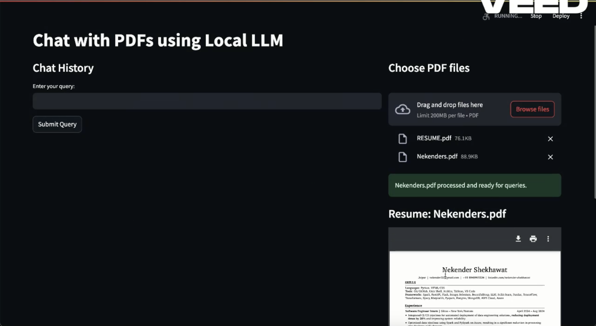
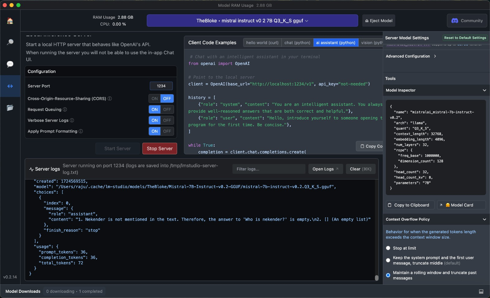

# Chat with PDFs using Local LLM

This Streamlit application enables interactive querying of PDF documents using a local large language model (LLM). The application highlights relevant text in the PDFs based on user queries and provides concise answers, leveraging advanced NLP techniques.

## Demo Video

[](https://youtu.be/ty0fqcGDHTI)


## Features

- **PDF Processing**: Extract and preprocess text from uploaded PDFs.
- **Query Processing**: Matches user queries with the most relevant sections in the PDF using sentence embeddings.
- **Text Highlighting**: Highlights relevant words or phrases in the PDF and provides an option to download the highlighted version.
- **Chat History**: Maintains a history of queries and responses, allowing for easy reference.

## Model Information

This application uses the following LLM model:

- **Model Name**: `mistralai_mistral-7b-instruct-v0.2`
- **Architecture**: LLaMA
- **Quantization**: Q3_K_S
- **Context Length**: 32,768
- **Embedding Length**: 4,096
- **Number of Layers**: 32
- **RoPE (Rotary Positional Embedding)**: 
  - Frequency Base: 1,000,000
  - Dimension Count: 128
- **Head Count**: 32
- **Head Count (Key/Value)**: 8
- **Parameters**: 7B

## Setup Instructions

### Prerequisites

- Python 3.7+
- An API key for [LMStudio](https://lmstudio.ai/) to use the LLM model. (This key can be obtained by signing up on the LMStudio platform.)
- 


### Installation

1. **Clone the repository**:
    ```bash
    git clone https://github.com/yourusername/chat-pdf.git
    cd chat-pdf
    ```

2. **Install the required dependencies**:
    ```bash
    pip install -r requirements.txt
    ```

3. **Set up the OpenAI client with LMStudio**:
    - Obtain your LMStudio API key.
    - Configure the OpenAI client to point to your local instance of the LLM by replacing `"api_key": "not-needed"` with your actual API key in the script.

4. **Run the Streamlit app**:
    ```bash
    streamlit run app.py
    ```

## Usage Guide

### Running the Application

1. **Upload PDFs**: Use the file uploader to upload one or multiple PDFs that you want to query.
2. **Submit a Query**: Enter a question in the text input box and click the "Submit Query" button.
3. **View Results**: The application will process your query, find the most relevant sections in the PDFs, and display the results in the chat history. If relevant text is found, it will be highlighted in the PDF, and the updated document will be displayed.

### Example

1. **Upload a PDF**: Click on the "Browse files" button or drag and drop your PDF files into the uploader.
2. **Enter a Query**: Type a question related to the content of the uploaded PDFs, such as "What is the primary objective mentioned in the document?".
3. **Get a Response**: The application will find and display the most relevant text, with the option to view a highlighted PDF.

## Approach and Design Decisions

### Model Selection

The `mistralai_mistral-7b-instruct-v0.2` model was selected for its efficiency in processing large context lengths and generating accurate, context-aware responses. The model's architecture is based on LLaMA, with quantization (Q3_K_S) that allows it to operate efficiently even on resource-constrained environments like local machines.

### PDF Processing

The application uses `PyPDF2` and `pdfplumber` for extracting text from PDFs, with preprocessing steps to clean and normalize the extracted text. This ensures the text is ready for NLP processing, which involves sentence embedding and similarity matching using the `sentence-transformers` library.

### Query Matching

Queries are processed by matching them to the most relevant text segments within the PDF. This is achieved by generating embeddings for both the query and the PDF content, and then computing cosine similarity to identify the most relevant sections.

### Text Highlighting

The application uses `PyMuPDF` (fitz) to highlight relevant text directly within the PDF. This feature allows users to see exactly where in the document the relevant information is located.

### Caching for Performance

To improve performance, the application employs caching using the `lru_cache` decorator, which stores the results of expensive query processing operations. This reduces response time for repeated queries.

